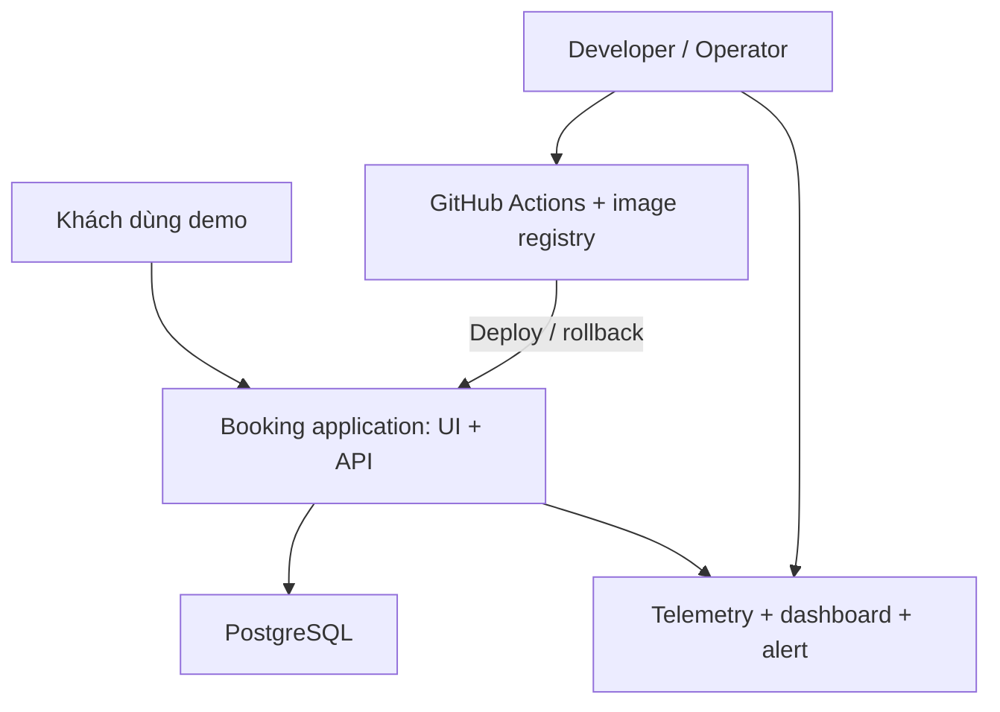

# Architecture context

## 1. Mục đích và bối cảnh

Production Readiness Lab xây một dịch vụ đặt lịch nhỏ để thực hành toàn bộ vòng đời: kiểm tra code, đóng gói, phát hành, triển khai, đo chất lượng dịch vụ, phát hiện sự cố và khôi phục phiên bản hoạt động.

Ứng dụng phải có chức năng thật để tạo tải và kiểm chứng kết quả. Quy mô nghiệp vụ được giữ nhỏ để dành thời gian cho độ tin cậy và khả năng vận hành.

## 2. Người dùng và nhu cầu

| Người dùng | Nhu cầu | Tương tác |
| --- | --- | --- |
| Khách dùng bản demo | Xem slot trống, đặt lịch, xem lịch và hủy lịch | React UI gọi API |
| Developer | Thay đổi code và nhận phản hồi kiểm tra tự động | Pull request, tests, GitHub Actions |
| Operator, có thể là developer | Theo dõi hệ thống, nhận cảnh báo, điều tra và rollback | Grafana, logs/traces, workflow deploy/rollback |
| Người đánh giá | Kiểm tra thiết kế được triển khai và quy trình khôi phục có hiệu quả | Tài liệu, code, kết quả tests, pipeline history, incident report |

## 3. Phạm vi nghiệp vụ và giả định

- Một lịch dùng chung cho một tài nguyên, ví dụ một phòng tư vấn. Mỗi slot dài 30 phút; điểm bắt đầu nằm ở phút 00 hoặc 30.
- UI hiển thị theo `Asia/Ho_Chi_Minh`. API nhận thời gian ISO 8601 có offset, chuẩn hóa UTC; PostgreSQL lưu bằng `timestamptz`.
- Slot chỉ được đặt trong tương lai. Một slot có tối đa một booking đang hoạt động.
- Booking có trạng thái `booked` hoặc `cancelled`. Hủy lịch giữ lại bản ghi để kiểm chứng và cho phép đặt lại slot.
- MVP dùng dữ liệu giả trong môi trường demo giới hạn truy cập. Chưa có tài khoản khách hàng; các thao tác xem/hủy thuộc lịch dùng chung. Cần thiết kế danh tính và quyền sở hữu booking trước khi mở dịch vụ cho khách hàng thật.
- Chưa có thanh toán, gửi email, nhiều cơ sở, lịch lặp hay đồng bộ lịch bên ngoài.

Các giả định này là lựa chọn thiết kế ban đầu, chưa phải yêu cầu đã được team xác nhận.

## 4. Ranh giới hệ thống

UI/API và dữ liệu booking thuộc hệ thống nghiệp vụ. GitHub Actions, registry và hệ thống observability hỗ trợ xây dựng, phát hành và vận hành. PostgreSQL và các dịch vụ observability được triển khai cùng môi trường lab nhưng có vòng đời dữ liệu riêng với container ứng dụng.

## 5. Ràng buộc và lựa chọn ban đầu

| Nội dung | Cơ sở | Áp dụng |
| --- | --- | --- |
| API + UI, tests, container, CI/CD, observability, rollback | Đề bài | Deliverable bắt buộc |
| GitHub Actions và OpenTelemetry | Công nghệ trong đề bài | Workflow tự động và instrumentation |
| React + FastAPI + PostgreSQL | Stack đã đề xuất trong trao đổi | UI, API, dữ liệu có transaction |
| Một Linux VM chạy Docker Compose | Giả định để kiểm soát chi phí và độ phức tạp | ADR-001; chưa chọn nhà cung cấp hoặc tạo VM |
| Một backend dạng modular monolith | Quy mô nghiệp vụ nhỏ | Một tiến trình API, chia module trong code |
| Tài nguyên lab có giới hạn | Điều kiện thiết kế | Giới hạn retention telemetry, đo tài nguyên trước demo |
| Có thể chạy từ máy Windows | Bối cảnh học tập | Code tương thích local; server đích là Linux |

## 6. Hợp đồng API dự kiến

| API | Mục đích | Kết quả chính |
| --- | --- | --- |
| `GET /api/slots?date=YYYY-MM-DD` | Xem slot trống trong ngày theo múi giờ UI | `200`, danh sách slot có timestamp/offset |
| `GET /api/appointments` | Xem lịch đã đặt, có phân trang | `200` |
| `POST /api/appointments` | Tạo booking | `201`; `409` khi slot đã được đặt; `422` khi đầu vào sai |
| `DELETE /api/appointments/{id}` | Chuyển booking sang `cancelled` | `204`; gọi lại booking đã hủy vẫn `204`; ID không tồn tại trả `404` |
| `GET /health/live` | Kiểm tra tiến trình API đáp ứng | `200`; không truy vấn DB |
| `GET /health/ready` | Kiểm tra API truy cập được DB và schema cần thiết | `200` hoặc `503` với timeout hữu hạn |
| `GET /api/version` | Xem phiên bản đang chạy | `200`, release và commit SHA |

Ví dụ dữ liệu tạo booking: `{"customer_name":"Cuong","starts_at":"2026-10-10T10:00:00+07:00"}`. Kết quả lưu thời điểm tương ứng `2026-10-10T03:00:00Z`.

Schema dự kiến: `appointments(id UUID, customer_name TEXT, starts_at TIMESTAMPTZ, status TEXT, created_at TIMESTAMPTZ, cancelled_at TIMESTAMPTZ NULL)`.

Database phải kiểm soát trạng thái hợp lệ và uniqueness của `starts_at` khi `status = 'booked'` bằng partial unique index. Chỉ kiểm tra slot trước khi INSERT trong Python chưa đủ khi hai request chạy đồng thời.

## 7. Thuộc tính chất lượng và tiêu chí đo

Các số dưới đây là **mục tiêu đề xuất**, không phải kết quả đã đo.

| Thuộc tính | Tình huống | Phản ứng mong đợi | Cách kiểm chứng |
| --- | --- | --- | --- |
| Data correctness | Hai người đặt cùng slot đồng thời | Một `201`, một `409`; DB có đúng một booking hoạt động | Integration test đồng thời với PostgreSQL |
| Reliability | Request nghiệp vụ trong điều kiện bình thường | SLO: ≥99,5% request đủ điều kiện không trả 5xx trong cửa sổ 30 ngày | Metrics HTTP và định nghĩa SLI bên dưới |
| Performance | Tải tham chiếu 10 request/giây trong 10 phút | ≥95% request đủ điều kiện hoàn tất dưới 500 ms | Load test, histogram; ghi VM, dữ liệu và phiên bản |
| Observability | Request trả 500 trong drill | Tìm được trace, log cùng trace ID, release và nguyên nhân | Dashboard → trace → log |
| Alertability | Error rate vượt 5% liên tục, có tải demo | Alert chuyển firing sau điều kiện 2 phút, hiển thị chậm nhất trong 3 phút | Lưu timestamp fault và firing |
| Recoverability | Release mới gây lỗi | Trở lại phiên bản tốt trong ≤5 phút kể từ bắt đầu rollback; booking cũ còn nguyên | Drill và smoke test sau rollback |
| Deployability | Thay đổi chưa qua test hoặc smoke test | Không chấp nhận release lỗi; deploy lỗi phải khôi phục bản trước | Một CI run fail và một deployment fail được ghi nhận |
| Testability | Kiểm tra service logic và DB contract | Unit tests tách nghiệp vụ; integration tests dùng DB thật | Báo cáo tests và mapping Evidence |

Định nghĩa SLI HTTP ban đầu: request đủ điều kiện là các request API nghiệp vụ kết thúc bằng 2xx, 3xx hoặc 5xx. Loại 4xx khỏi mẫu số vì đây là lỗi đầu vào hoặc từ chối theo nghiệp vụ; loại health checks và telemetry endpoints. SLI = số request đủ điều kiện không trả 5xx / tổng request đủ điều kiện. Với mẫu số bằng 0, hiển thị “chưa có dữ liệu”.

SLI dựa trên request hoàn tất không phát hiện đầy đủ trường hợp API chết và không phát sinh metrics. Bổ sung probe bên ngoài tiến trình API, kiểm tra readiness định kỳ và cảnh báo mất kết nối; theo dõi probe availability riêng. Không coi SLI HTTP này là tỷ lệ uptime toàn hệ thống.

Histogram độ trễ đo các request đủ điều kiện theo cùng phạm vi. Đo booking thành công và tỷ lệ xung đột riêng để không nhầm `409` với outage.

Trong buổi demo ngắn, báo cáo chỉ số trong khoảng quan sát thực tế; chưa thể kết luận đạt SLO 30 ngày. Health check thành công cũng chưa thay thế kiểm chứng nghiệp vụ.

## 8. Giới hạn vận hành cần đưa vào đánh giá

Một VM là điểm lỗi chung. Compose không cung cấp sẵn HA nhiều host hoặc rolling update không gián đoạn. Rollback thay image có thể tạo gián đoạn ngắn. Mục tiêu lab là đo và trình diễn các hành vi này; muốn HA cần kiến trúc triển khai khác.

Dashboard và telemetry chỉ nằm trong mạng quản trị. Giữ secret ngoài repository; dùng dữ liệu demo, không đưa tên khách hoặc nội dung request vào metric labels. Rollback ứng dụng không tự khôi phục dữ liệu hoặc schema.

## Nguồn kỹ thuật tham chiếu

- [Docker: Use Compose in production](https://docs.docker.com/compose/how-tos/production/) — mô hình triển khai Compose trên một server.
- [PostgreSQL: Partial indexes](https://www.postgresql.org/docs/18/indexes-partial.html) — partial unique index cho tập bản ghi thỏa điều kiện.
- [OpenTelemetry: Collector](https://opentelemetry.io/docs/collector/) — tiếp nhận, xử lý và xuất telemetry.

Các mục tiêu, API và quy tắc nghiệp vụ trong tài liệu là đề xuất riêng cho lab.
