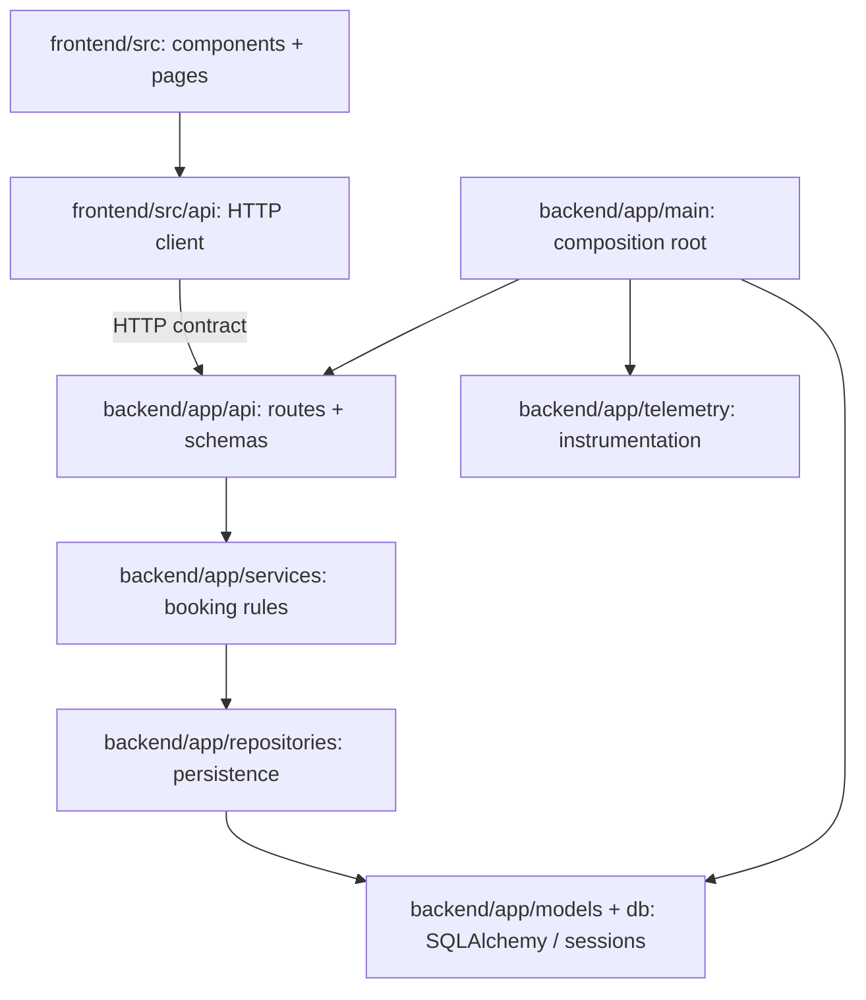

# Module view — Cấu trúc mã nguồn

Module view trả lời: code được chia thế nào, mỗi phần chịu trách nhiệm gì và phần nào được gọi phần nào. Nó khác với sơ đồ container đang chạy.

## 1. Phụ thuộc giữa các module nghiệp vụ

`main.py` là nơi khởi tạo và kết nối các thành phần. Mũi tên là hướng sử dụng. UI và backend không import code của nhau; chúng phối hợp qua HTTP contract.

## 2. Trách nhiệm và đường dẫn dự kiến

| Module | Đường dẫn dự kiến | Trách nhiệm | Giới hạn |
| --- | --- | --- | --- |
| UI | `frontend/src/pages/`, `frontend/src/components/` | Form, danh sách, trạng thái loading/error, hiển thị thời gian địa phương | Không quyết định uniqueness hoặc truy cập DB |
| HTTP client | `frontend/src/api/appointments.ts` | Gọi API, đọc response, xử lý mã lỗi | Không chứa business rules |
| API | `backend/app/api/appointments.py`, `backend/app/schemas/appointment.py` | Validate hợp đồng HTTP, gọi service, chuyển kết quả thành response | Không viết SQL hoặc commit transaction trực tiếp |
| Service | `backend/app/services/booking.py` | Slot 30 phút, thời gian tương lai, tạo/hủy booking, ranh giới transaction nghiệp vụ | Không phụ thuộc React, request/response FastAPI |
| Repository | `backend/app/repositories/appointments.py` | Query và persist, chuyển lỗi uniqueness thành lỗi domain | Không quyết định HTTP status |
| Model/DB | `backend/app/models/appointment.py`, `backend/app/db.py` | Mapping SQLAlchemy, engine, session, rollback transaction khi lỗi | Không trả response HTTP |
| Migration | `backend/alembic/versions/` | Schema, constraints, partial unique index | Schema thay đổi có version; không sửa DB bằng tay |
| Telemetry | `backend/app/telemetry/` | Spans, HTTP metrics, log bridge, trace correlation | Lỗi xuất telemetry không được làm booking thất bại |
| Bootstrap/config | `backend/app/main.py`, `backend/app/config.py` | Dependency wiring, lifecycle, đọc cấu hình môi trường | Không chứa logic đặt lịch |

Service nhận repository/session abstraction qua dependency injection. Unit test có thể dùng fake repository; test PostgreSQL thật vẫn bắt buộc để chứng minh uniqueness và transaction.

## 3. Quy tắc phụ thuộc

1. API gọi service; service dùng repository; repository dùng model/session.
2. Service phát sinh lỗi domain như `SlotAlreadyBooked` hoặc `InvalidSlot`; API ánh xạ tương ứng thành `409` hoặc `422`.
3. Repository bắt lỗi unique constraint cụ thể, phục hồi transaction và báo lỗi domain. Không chuyển mọi lỗi DB thành `409`; lỗi kết nối là lỗi hệ thống.
4. UI có thể kiểm tra đầu vào để hỗ trợ người dùng; backend và database vẫn là nơi thực thi quy tắc.
5. Migration và ứng dụng phải dùng cùng schema contract.

## 4. Module cấu hình và vận hành

| Nhóm | Đường dẫn dự kiến | Nội dung |
| --- | --- | --- |
| Container | `frontend/Dockerfile`, `backend/Dockerfile` | Build image cho từng ứng dụng |
| Deployment | `deploy/compose.yaml`, `deploy/compose.production.yaml` | Dịch vụ, network, volume, health checks, image refs |
| Release/rollback | `scripts/deploy.sh`, `scripts/rollback.sh` | Lưu bản hiện tại, thay image, smoke test, khôi phục |
| CI/CD | `.github/workflows/ci.yml`, `release.yml`, `rollback.yml` | Kiểm tra PR, build/push/deploy release, rollback thủ công |
| Observability | `observability/collector/`, `prometheus/`, `grafana/`, `tempo/`, `loki/` | Cấu hình pipeline telemetry, dashboards và alert rules |
| Kiểm chứng | `backend/tests/`, `frontend/tests/`, `tests/e2e/`, `tests/load/` | Unit, integration, UI, nghiệp vụ xuyên hệ thống và đo tải |
| Tài liệu | `docs/` | Context, views, ADR, evidence, runbook, incident |

Các mục trên là kế hoạch tổ chức source/config. PostgreSQL, Collector, Prometheus, Tempo, Loki và Grafana là **dịch vụ runtime**, không phải các package Python của backend. Module view ánh xạ tới mã nguồn và cấu hình mà team quản lý.
