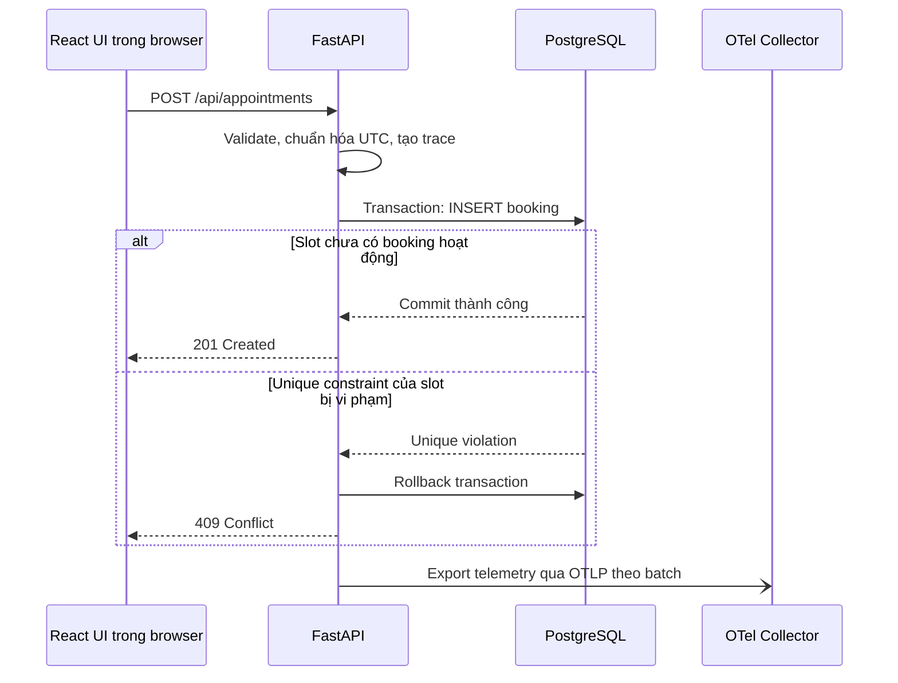
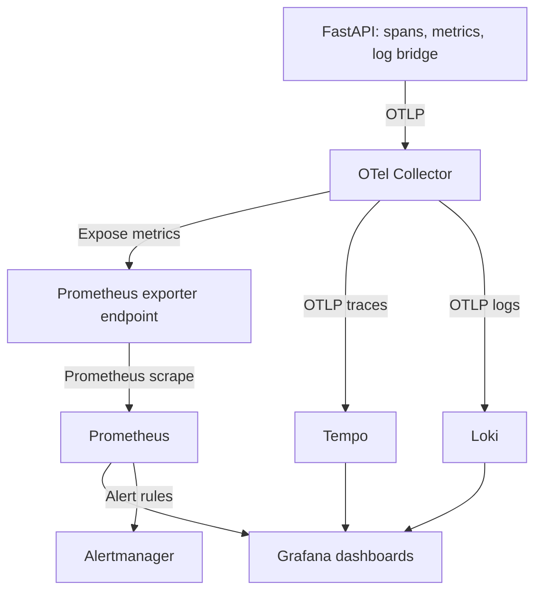

# Runtime view — Hệ thống khi chạy

## 1. Luồng đặt lịch và xử lý cạnh tranh

Kiểm tra slot trống trên UI chỉ là thông tin tại thời điểm xem. Partial unique index trong DB bảo vệ trước hai INSERT đồng thời. API chỉ trả `201` sau commit; lỗi DB ngoài uniqueness được xử lý như lỗi hệ thống và có telemetry.

Hủy booking cập nhật `status='cancelled'` và `cancelled_at`; partial index không còn giữ slot đó. Gọi lại thao tác hủy cùng ID trả `204`. Read/list truy vấn DB, không đọc dữ liệu từ memory của container.

## 2. Dịch vụ và mạng runtime

| Thành phần | Chạy ở đâu | Giao tiếp và vai trò |
| --- | --- | --- |
| React | JavaScript trong browser; static assets từ web container | HTTP tới cùng origin, đường dẫn `/api` |
| Web/reverse proxy | Container trên VM | Serve UI, chuyển `/api` tới FastAPI; TLS khi có public endpoint |
| FastAPI | Container trên VM | Truy cập PostgreSQL, export OTLP tới Collector |
| PostgreSQL | Container với volume riêng | Chỉ API/migration/test được truy cập qua mạng nội bộ |
| OTel Collector | Container trên VM | Nhận traces/metrics/logs; export tới backend tương ứng |
| Prometheus | Container trên VM | Scrape metrics exporter của Collector và probe service; đánh giá alert rules |
| Blackbox exporter | Container trên VM | Probe HTTP readiness, giúp phát hiện API không đáp ứng |
| Tempo và Loki | Containers trên VM | Lưu traces và logs, nhận qua OTLP pipeline phù hợp |
| Grafana | Container, truy cập quản trị | Query Prometheus/Tempo/Loki; dashboard và liên kết trace-log |
| Alertmanager | Container, truy cập quản trị | Nhận alert từ Prometheus, hiển thị/truyền thông báo theo cấu hình |

Chỉ web port được mở cho người dùng. DB/OTLP/metrics không mở ra Internet. Dashboard, alert và công cụ drill dùng đường quản trị giới hạn truy cập. Telemetry backends cần volume/retention riêng; không giả định dữ liệu sống mãi trong filesystem của container.

## 3. Pipeline observability

OpenTelemetry instrumentations/SDK nằm trong API để phát sinh telemetry. Collector nhận và chuyển tiếp; Grafana là nơi xem, còn Prometheus/Tempo/Loki lưu từng loại dữ liệu. Cần cấu hình đủ receivers/processors/exporters và kích hoạt pipeline cho từng signal; chỉ chạy Collector chưa tạo ra dashboard.

- **Logs:** JSON ra stdout để xem bằng Docker; log bridge gửi bản ghi qua OTLP. Ghi method, route template, status, duration, trace ID, service version. Không ghi mật khẩu, request body hoặc tên khách hàng.
- **Metrics:** request count, 5xx count, duration histogram, booking conflicts. Dùng route template như `/api/appointments/{id}`, tránh labels có UUID/trace ID để giới hạn cardinality.
- **Traces:** HTTP server span, service span cần thiết và DB spans. Demo có thể sample 100%; production cần điều chỉnh theo tải.
- **Correlation:** dùng cùng service name/version và trace ID để đi từ log tới trace. Ghi release/version vào telemetry để liên hệ sự cố với deployment.
- **Resilience:** export theo batch, timeout/queue hữu hạn; mất Collector không chặn booking. Test hành vi này thay vì chỉ giả định.

Metrics cần đầy đủ cho SLI, không suy ra tỷ lệ thành công từ tập trace đã sample. Probe độc lập với tiến trình API giúp phát hiện outage; probe cùng VM vẫn không phát hiện đầy đủ khi toàn VM chết. Khi mở public deployment, bổ sung probe từ bên ngoài VM.

## 4. Release và deployment

Workflow dự kiến:

1. Pull request chạy lint, unit tests, integration tests PostgreSQL, frontend build và Docker build checks. Fail thì không merge/deploy qua pipeline chuẩn.
2. Push tag phiên bản kích hoạt release workflow; workflow kiểm tra lại commit của tag, build images và push registry.
3. Ghi release manifest gồm tag, commit SHA, digest của frontend/backend và migration revision.
4. Deploy **đúng images đã build**, tham chiếu bằng digest; không build lại trên VM và không deploy bằng `latest`.
5. Lưu manifest hiện tại thành bản rollback, thực hiện migration tương thích nếu cần, cập nhật ứng dụng và chờ readiness với timeout hữu hạn.
6. Chạy smoke test: xem slot, tạo booking demo ở slot riêng và hủy booking đó. Nếu lỗi, workflow fail và gọi rollback về manifest tốt trước đó.
7. Nếu thành công, ghi thời gian và manifest mới làm bản hiện hành. Chỉ cho một deploy/rollback thay đổi môi trường tại một thời điểm.

Git tag xác định source release; Docker tag dễ đọc nhưng vẫn có thể bị ghi đè. Digest và manifest giúp chọn đúng image để rollback. Health check pass không đủ để chứng minh luồng nghiệp vụ.

## 5. Fault injection và incident drill

Chạy trên môi trường demo/staging riêng. Dùng release drill có cấu hình gây lỗi được mô tả trong manifest: ví dụ booking service trì hoãn 3 giây hoặc trả 500 trước thao tác ghi DB. Không cần phá DB hoặc xóa dữ liệu.

Fault được điều khiển bằng cấu hình triển khai, có thời hạn tự hết và chỉ được bật qua đường quản trị. Nếu fault là cấu hình ngoài image, rollback phải khôi phục cả cấu hình; chỉ đổi image chưa chắc tắt fault.

Sinh tải 10 request/giây → quan sát latency/5xx tăng → đợi alert firing → chọn một trace lỗi → tìm log tương ứng → xác định release và fault → rollback → chạy lại smoke test/tải → xác nhận phục hồi và alert resolved sau cửa sổ đánh giá.

Alert demo đề xuất: tỷ lệ 5xx trong cửa sổ 1 phút >5%, có ít nhất 100 request đủ điều kiện trong cửa sổ, duy trì 2 phút. Thêm alert cho probe fail. Ghi riêng các mốc phát sinh fault, firing, bắt đầu/kết thúc rollback và phục hồi. Đây là ngưỡng để demo; SLO 30 ngày vẫn là mục tiêu riêng.

## 6. Rollback và dữ liệu

Rollback khôi phục image refs và cấu hình ứng dụng từ manifest đã lưu, restart/recreate web/API, chờ readiness và kiểm tra luồng đặt/hủy. Không dùng `docker compose down -v` vì lệnh đó xóa named volumes.

Database giữ nguyên volume. Release mới chỉ thực hiện migration tương thích với code cũ khi còn cần rollback: ví dụ thêm cột nullable thay vì đổi/xóa cột ngay. Dùng phương pháp expand → chuyển code → contract ở release sau khi hết cửa sổ rollback. Nếu migration không tương thích, dừng trước deploy và lập kế hoạch dữ liệu riêng; không hứa rollback image sẽ sửa schema.

Một VM có thể gián đoạn ngắn khi thay container. Mục tiêu ≤5 phút được đo thực tế trong drill. Không gọi cơ chế này là zero-downtime deployment.
